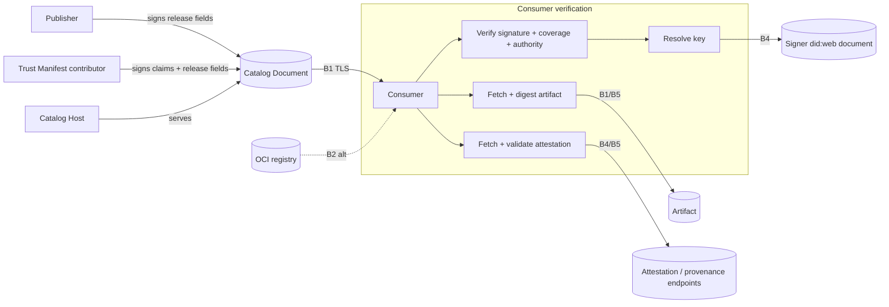

# Trust Manifest Threat Model

**Status:** Informational

**Date:** 2026-06-20

**Methodology:** STRIDE (Spoofing, Tampering, Repudiation, Information
disclosure, Denial of service, Elevation of privilege).

**Scope:** AI Catalog trust metadata — contributor Trust Manifests,
entry and catalog signatures, their verification procedures,
and the conformance levels that depend on it. Catalog mechanisms that
are not trust-bearing (media-type routing, nesting for organization,
version selection) are in scope only where they affect trust decisions.

This document is the security analysis that motivates the normative
hardening in [ai-catalog.md](ai-catalog.md) and the decisions recorded
in [ADR-0019](../adr/0019-trust-manifest-artifact-binding.md),
[ADR-0025](../adr/0025-bind-signed-trust-manifests-to-releases.md),
[ADR-0026](../adr/0026-remove-host-trust-manifests.md),
[ADR-0027](../adr/0027-did-web-entry-signature-profile.md),
[ADR-0028](../adr/0028-identity-keyed-trust-manifests.md), and
[ADR-0009](../adr/0009-trust-manifest-substitution.md). It exists to
answer the substitution-attack concern raised in ADR-0009: *"The
substitution attack of changing out the trust manifest is very real,
especially if there's no tamper-proofness built in."*

## 1. System Decomposition

### 1.1 External entities

Publisher
: Assigns the artifact's `urn:air` identifier and produces the artifact.
  Under the `did:web` Publisher Profile, the authenticated signer is the same
  domain authority as the publisher. Publishing automation can sign with a
  key authorized by the publisher's DID document.

Trust Manifest contributor
: Asserts claims or evidence references about an artifact release. A publisher,
  assessor, catalog operator, or registry can contribute its own manifest in
  `entry.trustManifests`. The identity key attributes the claims; it does not
  authenticate them. A contributor is not necessarily the issuer of the
  referenced evidence, nor authorized to endorse the publisher namespace.

Catalog Host
: Serves the AI Catalog document. May or may not be the publisher.
  Controls the bytes of the catalog at rest and in transit.

Consumer / Client
: Fetches the catalog, resolves entries, verifies trust metadata, and
  makes a trust decision (e.g., install, invoke, or surface an
  artifact to a user or agent). The asset being defended is the
  *correctness of this decision*.

Third-party endpoints
: Servers referenced by trust metadata or signatures: attestation documents
  (`attestation.uri`), signer key material (a signer's `did:web` DID
  document), and provenance statements (`statementUri`, `registryUri`).

OCI registry
: Optional content-addressed distribution channel (Layer 3).

Attacker
: See threat agents in section 3.

### 1.2 Data stores

- Catalog document (`application/ai-catalog+json`)
- Trust Manifests (values in the entry's contributor-identity map)
- Signature objects (on entries and the catalog root)
- Artifact bytes (served at `entry.url` or inlined in `entry.data`)
- Attestation documents
- Key material (DID documents and JSON Web Keys)
- Provenance statements
- OCI registry content + signatures (Cosign / Notation)

### 1.3 Processes

1. Catalog fetch and parse
2. Entry / nested-catalog resolution
3. Signature payload reconstruction, coverage checks, and verification
4. Signer-key resolution and contributor, publisher, or catalog authorization
5. Artifact fetch and digest computation
6. Attestation fetch and validation
7. Provenance evaluation

### 1.4 Data-flow and trust boundaries

Trust boundaries:

- **B1 — Transport.** Network path between the consumer and any
  server. Crossed by TLS. A network attacker without a valid
  certificate cannot read or alter traffic, but TLS says nothing about
  the authenticity of the *content* an authorized-but-malicious or
  compromised origin returns.
- **B2 — Catalog-document write.** Who can change the bytes of the
  catalog document at rest (hosting account, CDN, object store, DNS
  control, repository). This is the boundary the substitution attack
  crosses.
- **B3 — Signer private key.** The boundary between data an attacker can
  author and endorsements that require a publisher's, contributor's, or
  catalog operator's private key.
- **B4 — Third-party endpoints.** Servers referenced by the (possibly
  attacker-controlled) trust metadata, claimed signer, or signature key
  identifier. The consumer is induced to contact them.
- **B5 — Consumer verification egress.** The consumer's own network
  egress while fetching manifest-referenced URLs (SSRF surface).

## 2. Assets

| # | Asset | Why it matters |
|---|-------|----------------|
| AS1 | Integrity + authenticity of the artifact ↔ trust binding | The whole point of the Trust Manifest: that *these* claims describe *this* artifact. |
| AS2 | Publisher, contributor, and catalog-operator signing keys | Compromise lets an attacker forge authentic-looking trust. |
| AS3 | The consumer's trust decision | The ultimate target — install/invoke a malicious artifact under a trusted label. |
| AS4 | Availability of catalog resolution | Consumers depend on resolving catalogs to find tools. |
| AS5 | Consumer privacy / telemetry | Fetches triggered by verification can leak who is evaluating what, and from where. |

## 3. Threat Agents and Assumptions

| ID | Agent | Capability | In scope |
|----|-------|------------|----------|
| A1 | Network attacker | On-path, **cannot** break TLS | Yes (bounded) |
| **A2** | **Catalog-write attacker** | Can modify the catalog document (compromised hosting account, CDN edge, object-store credentials, compromise of the catalog origin, or a malicious mirror). **Cannot** control the expected signer's `did:web` domain or obtain that signer's authorized key. | **Yes — primary** |
| A3 | Malicious publisher or contributor | Authors claims and signs selected fields with a key it legitimately controls | Yes |
| A4 | Compromised third-party endpoint | Controls an attestation, key, or provenance endpoint used during verification | Yes |
| A5 | Malicious nested/federated author | Authors a sub-catalog that a parent delegates to | Yes |
| A6 | Key-compromise / stale-key attacker | Holds a previously valid (revoked or rotated) signer key, or replays old signed material | Yes |

Out of scope: breaking TLS or the underlying hash/signature
primitives; compromise of the consumer's own host; supply-chain
compromise of the artifact *before* the publisher signs it (the
manifest can only attest to what the publisher saw).

## 4. STRIDE Analysis

Each threat references the finding IDs carried in the companion review and
maps to a mitigation in section 6. Pre-mitigation descriptions record the
specification state at the time each gap was found; the corresponding controls
describe the resulting design.

### 4.1 Spoofing

| ID | Threat | Boundary | Agent | Finding |
|----|--------|----------|-------|---------|
| S1 | **Self-asserted identity.** If key resolution derives the signer's key only from an unconstrained `identity` URI in the manifest, a catalog-write attacker can substitute both `identity` and the key endpoint and sign with their own key. Verification then proves only "signed by whoever owns this identity." | B2/B3 | A2 | F3 |
| S2 | **Publisher spoofing.** `publisher.identifier`/`displayName` live on the entry, outside any signature; an attacker edits them to impersonate a reputable vendor. | B2 | A2 | F9 |
| S3 | **Host spoofing.** `host.identifier` is attacker-controllable when the catalog is compromised; DID-service-endpoint checks only prove internal consistency of attacker-chosen data. | B2 | A2 | — |

### 4.2 Tampering

| ID | Threat | Boundary | Agent | Finding |
|----|--------|----------|-------|---------|
| **T1** | **Artifact substitution under a valid signature (headline).** The `signature` covers only the Trust Manifest JSON. The artifact is referenced by `entry.url`/`data`/`mediaType`, which sit *outside* the signed bytes. The only binding is `identity == entry.identifier`. An attacker keeps the publisher's validly-signed manifest, leaves `identifier` intact, and repoints `url` to a malicious artifact. Signature still verifies. `provenance.sourceDigest` is OPTIONAL and denotes the *source* (`publishedFrom`), not the served artifact, so it does not close the gap. | B2 | A2 | F1 |
| T2 | **Unsigned manifest tampering.** Level 3 ("Trusted Catalog") requires only that a `trustManifest` be *present*, not signed. An attacker freely rewrites every claim in an unsigned manifest. The "Trusted" label implies cryptographic assurance that is not enforced. | B2 | A2 | F2 |
| T3 | **Catalog-level structural tampering.** Nothing signs the `entries` array or `host`. Even with per-entry signed manifests, an attacker injects new (malicious, unsigned) entries, deletes entries, or reorders/selects versions. Only OCI Layer 3 addresses this today. | B2 | A2/A5 | F6 |
| T4 | **Release-coordinate relabeling under a valid signature.** A signed `subject` binds the exact artifact representation but not `entry.identifier` or `entry.version`. An attacker keeps the valid manifest and exact bytes while assigning them to another logical artifact in the same publisher namespace or labeling an old release with a higher version. Signature, type, URL, and digest checks still pass. | B2 | A2 | F11 |

### 4.3 Repudiation

| ID | Threat | Boundary | Agent | Finding |
|----|--------|----------|-------|---------|
| R1 | **No issuance time / audit anchor.** A signed manifest carries no `issuedAt`, so a consumer cannot tell *when* a claim was made or which artifact version it covered, weakening dispute resolution and rollback detection. | B3 | A6 | F5 |
| R2 | **Half-specified provenance signatures.** `statementUri` + `signatureRef` exist but have no verification procedure, so provenance statements cannot be relied on as non-repudiable evidence. | B4 | A4 | F8 |

### 4.4 Information disclosure

| ID | Threat | Boundary | Agent | Finding |
|----|--------|----------|-------|---------|
| I1 | **SSRF.** Verification instructs the consumer to fetch attacker-influenced URLs (`attestation.uri`, `statementUri`, `registryUri`, key URLs). A crafted manifest can target internal/loopback/link-local/cloud-metadata addresses from the consumer's network position. | B4/B5 | A2/A4 | F7 |
| I2 | **Verification telemetry / tracking.** Fetches reveal which consumer (IP, identity) is evaluating which artifact, and when. Logo and attestation fetches leak the same. | B1/B5 | A2/A4 | F7 |

### 4.5 Denial of service

| ID | Threat | Boundary | Agent | Finding |
|----|--------|----------|-------|---------|
| D1 | **Oversized / slow verification fetches.** `attestation.size` is OPTIONAL; large attestation documents, large inline `data`, or slow endpoints exhaust consumer memory/connections during verification. | B4/B5 | A2/A4 | F7 |
| D2 | **Nested / circular catalog expansion.** Deep or circular nested catalogs amplify work. (Already addressed by the depth limit and visited-set guidance; retained here for completeness.) | B2 | A2/A5 | — |

### 4.6 Elevation of privilege

| ID | Threat | Boundary | Agent | Finding |
|----|--------|----------|-------|---------|
| E1 | **Signature-algorithm confusion.** The spec mandates detached JWS but constrains no algorithms. Acceptance of `alg: none` or symmetric-vs-asymmetric key confusion (using a public key as an HMAC secret) lets an attacker forge a "valid" signature with no private key. | B3 | A2 | F4 |
| E2 | **Rollback / downgrade.** With no freshness binding and multi-version entries, an attacker replays an older, validly-signed manifest plus its older (e.g., since-patched) artifact, or a manifest signed before a key was revoked. The consumer accepts authentic-but-stale trust. | B2/B3 | A6 | F5 |

## 5. Attack Scenarios

These scenarios describe the weaknesses that motivated the findings; their
closing statements summarize the current controls.

**SC-1 — URL swap under a valid signature (primary).** Acme publishes
`urn:air:acme-corp.com:agent:finance` with a manifest signed by
`did:web:acme-corp.com`. An attacker who compromises Acme's CDN leaves
the manifest byte-for-byte intact and changes only `entry.url` to a
look-alike host serving a trojaned agent. A Layer-2 consumer "verifies
the signature," sees green, and installs malware. *Closed by F1
mitigation: the same entry signature must cover the claims and required release
fields, including `entry.digest`; the consumer must verify the artifact bytes
against that digest.*

**SC-2 — False trust at Level 3.** A catalog advertises Level 3 with
unsigned manifests. A consumer treats "Trusted Catalog" as
cryptographic assurance and accepts attacker-rewritten attestations.
*Addressed by F2 mitigation: consumers may rely on a claim as a named
contributor's assertion only when an acceptable signature authenticated as that
contributor covers the claim and the same entry release.*

**SC-3 — Self-signed substitution.** An attacker attributes replacement claims
to `did:web:attacker.example` and signs them with their own key. That signature
cannot authenticate the publisher of `urn:air:example.com:...`: the `did:web`
Publisher Profile requires `did:web:example.com`, and entry release coverage
requires the same signature to select the complete identifier. The attacker
can publish a separately named artifact under `urn:air:attacker.example:...`,
but cannot impersonate the original publisher namespace. *Closed for standard
`urn:air` identifiers by F3.*

**SC-4 — alg:none forgery.** An attacker sets the JWS header `alg` to `none`
(or `HS256` keyed with the publisher's public key) and forges a manifest with
no private key. *Closed by F4: the interoperable profile accepts only ES256 and
requires a matching P-256 public key from the DID document.*

**SC-5 — Downgrade.** A patched v2.1 exists, but the attacker re-serves
the still-validly-signed v2.0 manifest and artifact. `issuedAt` and an optional
`expiresAt` can inform consumer policy, but they do not prove that v2.0 is the
publisher's current release. Preventing rollback requires a trusted source of
current release information or consumer state recording a newer accepted
release. *Residual risk described by F5.*

**SC-6 — Verification SSRF.** A manifest sets
`attestation.uri = http://169.254.169.254/latest/meta-data/…`; the
consumer's verifier fetches it and exfiltrates cloud credentials.
*Closed by F7 mitigation: safe-fetching rules.*

**SC-7 — Entry injection.** Attacker appends an unsigned malicious
entry to a catalog full of legitimately signed entries. *Mitigated by
F6: a signature satisfying Catalog Snapshot Coverage with applicable operator
authorization, or an authenticated content-addressed channel.*

**SC-8 — Version relabeling.** A publisher releases v2.0 and signs its claims
and artifact digest. An attacker leaves the signed manifest and exact artifact
bytes unchanged but changes `entry.version` to v9.0. Because the entry version
is authoritative for catalog-level sorting and selection, the old release can
be selected as latest while every existing per-entry verification check
passes. *Closed by F11: the same entry signature must select `entry.version`
whenever the containing entry has a version.*

## 6. Controls

The earlier controls below identify the gaps behind the historical findings.
The current controls summarize the specification's requirements and their
limits; consumer acceptance still depends on the selected coverage and
applicable signer authority.

| Finding | Threats | Earlier control | Current control or limitation | Spec section |
|---------|---------|------------------|-------------------------------|--------------|
| F1 | T1 | Detached JWS over manifest; OPTIONAL `sourceDigest` | Require the same entry signature to cover the claims relied upon and entry `identifier`, `type`, `digest`, and `version` when present; verify the artifact against `entry.digest` | Verification → Entry Release Coverage |
| F2 | T2 | Level 3 requires manifest presence | Level 3 requires an acceptable publisher-authorized release signature where publisher authenticity is relied upon; named-contributor claims require that contributor's acceptable signature over those claims and the release | Conformance Level 3 |
| F3 | S1 | Unconstrained key resolution from `identity` | Authenticate the signed `signer` identity through an assertion-authorized key whose protected `kid` has that exact DID portion; require that signer to match the manifest identity key for contributor attribution, and the signed `urn:air` publisher domain for publisher authorization | Verification → `did:web` Signer and Publisher Profiles |
| F4 | E1 | "detached JWS" | Require ES256 with a P-256 `publicKeyJwk` in the initial Signer Profile; require protected `alg` and `kid`; prohibit attacker-selected key-source headers | Verification → `did:web` Signer Profile |
| F5 | R1, E2 | Signature times and current key authorization | Check current key authorization and each signature's authenticated `issuedAt` and optional `expiresAt`; compare acceptable contributor signatures covering the whole manifest for observed updates. Trusted current-release information or consumer state is still required to prevent rollback | Trust Manifest → Independent Contributions and Updates; Verification → Signature Acceptance and Time |
| F6 | T3 | OCI Layer 3 (informative) | Require complete root-field coverage for snapshot acceptance and separate operator authorization; recommend a signature meeting both requirements or an authenticated content-addressed channel | Verification → Catalog Snapshot Coverage and Catalog Authorization; Security Considerations |
| F7 | I1, I2, D1 | none | Safe-Fetching subsection: size caps, timeouts, no redirects to private ranges, host allowlist | Verification → Safe Fetching |
| F8 | R2 | Fields only | Delegate signer authorization and signature verification to the provenance statement's format; an entry endorsement of its reference does not verify the statement itself | Verification → Provenance Statements |
| F9 | S2 | Publisher fields outside the signed Trust Manifest | Distinguish selected metadata authenticated by the publisher from unselected metadata or another entity's endorsement; release coverage alone does not authenticate publisher or policy fields | Verification → Publisher and Policy Metadata |
| F10 | — | JCS | JCS-canonicalize the payload binding the claimed signer, profile identifier, paths, selected values, context, and signature times; enforce path-resolution rules and I-JSON constraints, including numeric round-trip limits | Verification → Signature Object |
| F11 | T4 | Signed subject contains representation type, digest, and optional URL only | Require the same signature to select entry `identifier` and `version` when present, alongside the representation and claims; adding an unsigned version makes coverage insufficient | Verification → Entry Release Coverage |

## 7. Comparison with the Sigstore Architecture

The Trust Manifest derives its model from Sigstore — sign an artifact,
associate it with an identity, and make the evidence verifiable — but it
reproduces only part of Sigstore's guarantees natively. Sigstore secures
software supply chains with three cooperating roles:

- **Cosign** signs the artifact's *digest* (not just metadata).
- **Fulcio** is a certificate authority that binds an ephemeral signing
  key to an OIDC identity and issues a short-lived certificate, so
  identity is asserted by a *trusted CA* rather than self-declared.
- **Rekor** is an immutable, append-only **transparency log** that
  witnesses each signing event (digest + signature + certificate),
  giving public auditability, non-repudiation, freshness, monitoring,
  and rollback detection (inclusion and consistency proofs).
- A **TUF**-managed root of trust distributes and rotates the Fulcio and
  Rekor public keys.

Verifying a Sigstore artifact means: verify the signature with the
certificate's public key; confirm the certificate identity matches an
*expected* identity; verify the certificate against Sigstore's root of
trust; and verify proof of inclusion in Rekor. The artifact is thereby
proven to come from its expected source and to be untampered.

### 7.1 Mapping

| Sigstore property | Provides | AI Catalog trust model | Gap (finding) |
|-------------------|----------|----------------------|---------------|
| Cosign signs the artifact **digest** | Artifact ↔ signature binding | Selected entry `digest`, with verified artifact bytes | Closed (F1) |
| **Fulcio** CA binds identity via OIDC; short-lived cert | Identity is CA-attested, not self-asserted | The Publisher Profile requires the signed `urn:air` publisher domain to match the authenticated root `did:web` signer; the Signer Profile also authenticates independent contributors | Different assurance — domain control rather than CA-attested OIDC identity |
| **Rekor** transparency log | Non-repudiation, freshness, monitoring, rollback detection | No transparency-log equivalent; `issuedAt`/`expiresAt` give weak local freshness only | Open (F5, R1, E2) |
| **Keyless / ephemeral keys** | No long-lived key management or revocation problem | Long-lived signer keys (DID/JWK); inherits key-management + revocation burden | Open (residual AS2) |
| **TUF** root of trust | Secure distribution + rotation of verification keys | The `did:web` profile inherits DNS and Web PKI roots; it defines no application-specific root distribution | Delegated infrastructure |
| Verify expected identity + cert chain + Rekor inclusion | Full verification chain | Verify signer identity and current assertion key, signature, release and claim coverage, artifact digest, and authority for the claimed role; no inclusion proof | Partially open |

### 7.2 Implications

- **What the Trust Manifest now matches.** With entry release coverage,
  an accepted endorsement reproduces Cosign's core property that a signature
  commits to a specific artifact digest and additionally binds selected claims
  to the logical artifact release. This directly closes the representation
  substitution and release-coordinate relabeling attacks (T1, T4).
- **What it delegates.** The Trust Manifest deliberately does not operate a CA
  or a transparency log. The `did:web` profile delegates domain authentication
  to DNS and the Web PKI, then uses the DID document to authorize the current
  assertion key. Consumer policy still determines whether the authenticated
  publisher or contributor and its claims are trusted for a particular use.
- **What is still weaker than Sigstore.** Without a Rekor-equivalent,
  the Trust Manifest cannot offer public auditability, third-party
  witnessing, or strong rollback detection; `issuedAt`/`expiresAt` are a
  local, unwitnessed approximation. Long-lived signer keys reintroduce
  the key-management and revocation problems Sigstore was designed to
  eliminate.

### 7.3 Recommended convergence

To close the remaining gaps, the specification SHOULD make Sigstore
evidence first-class rather than reinventing it:

1. **Carry Fulcio/Cosign evidence.** Define an attestation `type` (e.g.,
   `sigstore-bundle`) whose document is a Sigstore bundle (certificate +
   signature + Rekor inclusion proof). Verifying it gives CA-attested
   identity and log inclusion "for free," and the entry's `digest`
   aligns with what Cosign signs.
2. **Define a separate Sigstore profile.** A future profile could use
   Sigstore's TUF-managed root and Fulcio identity instead of the base
   `did:web` domain-control profile.
3. **Prefer transparency-log inclusion over local freshness.** Where a
   Rekor (or compatible) inclusion proof is available, consumers SHOULD
   prefer it to `issuedAt`/`expiresAt` for freshness, non-repudiation,
   and rollback detection.
4. **Favor keyless/ephemeral signing.** Treat long-lived publisher keys
   as the fallback, not the default, to avoid the revocation burden.

This keeps the Trust Manifest's artifact-agnostic, peer-element design
while letting trust-sensitive deployments inherit Sigstore's full chain
(CA identity + transparency + keyless) instead of a weaker re-implementation.

## 8. Residual Risks

- **Catalog-operator authentication.** HTTPS from an expected domain can
  authenticate the transport endpoint, but a DID service-endpoint check alone
  does not authenticate attacker-selected Host Info. A catalog signature can
  protect the snapshot only after its signer and key are independently
  authorized and the signature covers the complete snapshot. The base
  specification leaves operator authorization to a separate profile or
  configured policy; selected Host Info alone does not supply it.
- **Domain and policy roots.** The `did:web` profile inherits the consumer's DNS
  and Web PKI trust roots. The Signer Profile authenticates domain control;
  the Publisher Profile additionally binds that domain to the publisher
  namespace. Neither decides whether a signer is reputable or authorized by
  a particular organization. Allowlisting, registry vetting, and other
  application trust decisions remain consumer policy.
- **Signer-key compromise (AS2).** An authenticated endorsement
  is only as trustworthy as the signer's key hygiene. Short-lived
  keys, revocation checking, and OCI/Cosign counter-signatures reduce
  but do not eliminate this.
- **Pre-signing supply-chain compromise.** If a malicious artifact is
  signed by a legitimate publisher, the manifest faithfully attests to
  a bad artifact. Out of scope here; addressed by build-provenance
  (SLSA) practices upstream.
- **Catalog availability (AS4).** Even with full integrity, an attacker
  who can delete the catalog or block resolution causes denial of
  service; mitigated operationally (caching, mirrors, OCI), not by the
  trust model.
- **Metadata privacy (AS5).** Verification fetches inherently reveal
  some consumer activity; Data-URI attestations/logos and host
  allowlists reduce, but cannot fully remove, this exposure.
